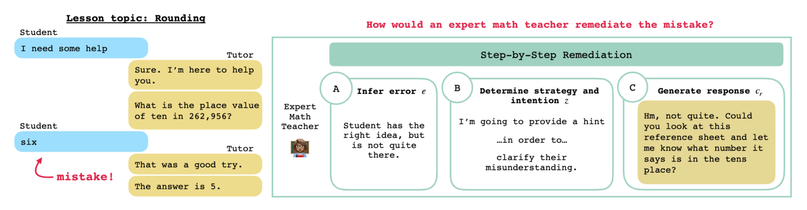

# Step-by-Step Remediation of Students' Mathematical Mistakes

[Project Page](https://rosewang2008.github.io/remath/), [Paper](https://arxiv.org/abs/2310.10648)

**Authors:** Rose E. Wang, Qingyang Zhang, Carly Robinson, Susanna Loeb, Dorottya Demszky

If you find our work useful or interesting, please consider citing it! 

```
@misc{wang2023stepbystep,
      title={Step-by-Step Remediation of Students' Mathematical Mistakes}, 
      author={Rose E. Wang and Qingyang Zhang and Carly Robinson and Susanna Loeb and Dorottya Demszky},
      year={2023},
      eprint={2310.10648},
      archivePrefix={arXiv},
      primaryClass={cs.CL}
}
```



Repo contents: 
- [Repo Structure](#repository-structure)
- [Installation](#installation)
- [ReMath Dataset](#remath-dataset)
- [(Optional) Generate Outputs to Task A-C](#optional-generate-outputs-for-all-tasks)
- [Task A-C Evaluations](#evaluations-replicating-paper-figures)


## NOTE: THE DATA WILL BE RELEASED SOON!

## Repository Structure

```
.
├── remath_dataset          # ReMath dataset!
├── outputs                 # Contains all models' outputs & metric results
├── prompts                 # Prompts used for tasks 
├── results                 # Result plots used in paper
├── scripts                 # Python scripts for analysis
├── requirements.txt        # Install requirements for running code
├── analyze_experiments.sh  # Complete analysis script
├── collect_responses.sh    # (Optional) Script for collecting responses from models on tasks
├── LICENSE
└── README.md
```

## Installation

To install the required libraries: 

```
conda create -n remath python=3
conda activate remath
pip install -r requirements.txt
```

Optional: If you want to generate the responses from scratch, you'll need to set your OpenAI API key:
```
>>> export OPENAI_API_KEY='yourkey'
```

## ReMath dataset

The numbers for the final dataset should be:

```
Total: 700
Train: 419
Validation: 71
Test: 210
```

The structure of each item in the dataset is as follows:

```
'c_id': Conversation ID.
'lesson_topic': Lesson Topic.
'c_h': Conversation History. The last conversation turn is the student's, where they make a mistake.
'c_r': The original tutor's response to the student.
'c_r_': The expert math teacher's response.
'e': The error type identified by the expert math teacher.
'z_what': The strategy used by the expert math teacher.
'z_why': The intention used by the expert math teacher.
'enough_context': Whether the conversation has enough context about the problem discussed. 
```

Here's an example:
```
  {
      "c_id": "2879185_27",
      "lesson_topic": "3.4B.Rounding Whole Numbers",
      "c_h": [
          {
              "id": 27,
              "text": "Let's get started.",
              "user": "tutor"
          },
          {
              "id": 28,
              "text": "We have to round 2,458 to the nearest hundred.",
              "user": "tutor"
          },
          {
              "id": 29,
              "text": "Is that your final answer?",
              "user": "tutor"
          },
          {
              "id": 30,
              "text": "yes",
              "user": "student"
          }
      ],
      "c_r": [
          {
              "id": 31,
              "text": "That was a good try.",
              "user": "tutor"
          },
          {
              "id": 32,
              "text": "1 point for that.",
              "user": "tutor"
          },
          {
              "id": 33,
              "text": "Let me explain it to you.",
              "user": "tutor"
          }
      ],
      "c_r_": [
          {
              "user": "tutor",
              "text": "Good try! But your answer is incorrect - since we want to round to the hundred we should look at the hundreds place. Can you tell me what number is in the hundreds place?",
              "is_revised": true
          }
      ],
      "e": "diagnose",
      "z_what": "ask_question",
      "z_why": "correct_mistake",
      "enough_context": 1
  }
```

## (Optional) Generate Outputs For All Tasks 

**NOTE**: You do not need to run the following script because the directory `outputs` contains all of the models' outputs already!

If you'd like to re-train and re-collect the models' outputs on all of the tasks, run 

```
source collect_responses.sh
```

## Evaluations (Replicating Paper Figures)

**NOTE** You do not need to run the following script because the directory `results` contains all of the results and plots already! This is only included for completeness and if you want to re-run the evaluations.

**TLDR**: Run `source analyze_experiments.sh` which will launch all the scripts to replicate the paper's figures. The results will be populated under the `results/`

### Task A: Infer Error (e)

The results will be under `results/task1_infer_error`. To reproduce the numbers in Table 1 and the distribution plot in Figure 4, run:
```
python3 scripts/evaluate/run_task12_evaluations.py --task=1 --run_distribution_analysis --run_irr_analysis --run_count_analysis --run_heatmap_analysis > results/task1_infer_error/task1_infer_error.txt 
```

### Task B: Determine Strategy and Intention (z)

The results will be under `results/task2_strategy`. To reproduce the numbers in Table 2, the distribution and heatmap plots reported in Figure 4 and 15, run: 
```
python3 scripts/evaluate/run_task12_evaluations.py --task=2 --run_distribution_analysis --run_irr_analysis --run_count_analysis --run_heatmap_analysis > results/task2_strategy/task2_strategy.txt
```

### Task C: Generate Response (c_r)

The results will be under `results/task3_generate_response`. To reproduce the human evaluation numbers in Table 3, run
```
# Human evaluation results (Table 3)
python3 scripts/evaluate/run_task3_human_evaluations.py  --run_score_analysis > results/task3_generate_response/human_evaluations/human_evaluations.txt
```

To reproduce the automated metrics numbers in Table 8, run

```
OPENSOURCE_MODELS=("flan-t5" "godel")
API_MODELS=("chatgpt" "gpt4")

##### Automated metrics 
python3 scripts/evaluate/run_task3_automated_evaluations.py --method human > results/task3_generate_response/human.txt # Expert math teachers
python3 scripts/evaluate/run_task3_automated_evaluations.py --method original > results/task3_generate_response/original.txt # Original tutors
for model in "${OPENSOURCE_MODELS[@]}"; do
    python3 scripts/evaluate/run_task3_automated_evaluations.py --method ${model}_finetuneTrue_eFalse_zFalse_rFalse > results/task3_generate_response/automated_evaluations/${model}_finetuneTrue_eFalse_zFalse_rFalse.txt
    python3 scripts/evaluate/run_task3_automated_evaluations.py --method ${model}_finetuneTrue_eTrue_zFalse_rFalse > results/task3_generate_response/automated_evaluations/${model}_finetuneTrue_eTrue_zFalse_rFalse.txt
    python3 scripts/evaluate/run_task3_automated_evaluations.py --method ${model}_finetuneTrue_eFalse_zTrue_rFalse > results/task3_generate_response/automated_evaluations/${model}_finetuneTrue_eFalse_zTrue_rFalse.txt
    python3 scripts/evaluate/run_task3_automated_evaluations.py --method ${model}_finetuneTrue_eTrue_zTrue_rFalse > results/task3_generate_response/automated_evaluations/${model}_finetuneTrue_eTrue_zTrue_rFalse.txt
done
for model in "${API_MODELS[@]}"; do
    python3 scripts/evaluate/run_task3_automated_evaluations.py --method ${model}_finetuneFalse_eFalse_zFalse_rFalse > results/task3_generate_response/automated_evaluations/${model}_finetuneFalse_eFalse_zFalse_rFalse.txt
    python3 scripts/evaluate/run_task3_automated_evaluations.py --method ${model}_finetuneFalse_eTrue_zFalse_rFalse > results/task3_generate_response/automated_evaluations/${model}_finetuneFalse_eTrue_zFalse_rFalse.txt
    python3 scripts/evaluate/run_task3_automated_evaluations.py --method ${model}_finetuneFalse_eFalse_zTrue_rFalse > results/task3_generate_response/automated_evaluations/${model}_finetuneFalse_eFalse_zTrue_rFalse.txt
    python3 scripts/evaluate/run_task3_automated_evaluations.py --method ${model}_finetuneFalse_eTrue_zTrue_rFalse > results/task3_generate_response/automated_evaluations/${model}_finetuneFalse_eTrue_zTrue_rFalse.txt
done
```